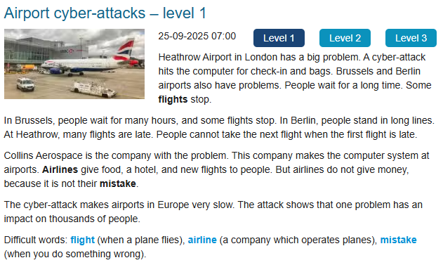

### Entendimento
O Aeroporto de Heathrow em Londres tem um grande problema. Um ataque cibernético afetou um computador responsável pelos check-ins e pelas bagagens. Os aeroportos de Bruxelas e de Berlim também tiveram problemas. Pessoas ficaram esperando por muito tempo. Alguns voos pararam.

Em Bruxelas, pessoas esperaram por muitas horas, e alguns voos ficaram parados. Em Berlim, pessoas ficaram em longas filas. Em Heathrow, muitos voos estão atrasados. Pessoas não podem pegar o próximo voo quando o primeiro voo está atrasado.

Collins Aerospace é a companhia com o problema. Esta companhia fez o sistema do computador dos aeroportos. As companhias aéreas deram comida, hotel e novos voos para as pessoas. Mas as companhias não devolveram o dinheiro, porque isso não era um erro delas.

O ataque cibernético fez os aeroportos da Europa ficarem muito lentos. Os ataques mostraram que aquele único problema teve um impacto em milhares de pessoas.

### Palavras difíceis neste contexto
Airlines = Companhias aéreas

### Novas palavras
when = Quando

their = deles

thousands = milhares

### Correção da IA

### Correção da Tradução
- **A cyber-attack hits the computer for check-in and bags.**  
Você traduziu: "Um ataque cybernetico atacou um computador responsavel pelos checkins e as bagagens."  
✅ Correção: verbo no presente → *afeta/atinge*, não “atacou”.  

- **Some flights stop.**  
Você traduziu: "Alguns vôos pararam."  
✅ Correção: verbo no presente → *alguns voos param*, não “pararam”.  

- **This company makes the computer system at airports.**  
Você traduziu: "Esta compania fizeram o sistema do computador dos aeroportos."  
✅ Correção: verbo no presente → *faz o sistema*, não “fizeram”.  

- **Airlines give food, a hotel, and new flights to people.**  
Você traduziu: "As companhias aéreas deram comida, um hotel, e novos vôos para as pessoas."  
✅ Correção: verbo no presente → *dão comida, hotel e novos voos*, não “deram”.  

- **The cyber-attack makes airports in Europe very slow.**  
Você traduziu: "O ataque cybernetico fizeram os aeroportos da Europa ficarem muito lentos."  
✅ Correção: verbo no singular → *faz os aeroportos ficarem lentos*, não “fizeram”.  

- **The attack shows that one problem has an impact on thousands of people.**  
Você traduziu: "Os ataques mostraram que aquele unico problema teve um impacto em milhares de pessoas."  
✅ Correção: verbo no presente → *mostra que um problema tem impacto em milhares de pessoas*, não “mostraram / teve”.

