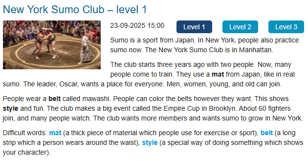

### Entendimento
Sumo é um esporte do Japão. Em Nova York, as pessoas também praticam sumo agora. O clube de sumo de Nova York fica em Manhattan.

O clube começou há três anos com duas pessoas. Agora, muitas pessoas vêm treinar. Eles usam um tapete grosso do Japão, como no sumo original. O líder, Oscar, deseja um lugar para todos. Homens, mulheres, jovens e velhos podem entrar.

As pessoas usam uma faixa chamada mawashi. As pessoas podem colorir os cintos como elas quiserem. Isto mostra seu estilo e diversão. O clube faz grandes eventos chamados Empire Cup in Brooklyn. Cerca de 60 lutadores participam, e muitas pessoas assistem. O clube quer mais membros e quer que o sumo cresça em Nova York.

### Palavras difíceis neste contexto
mat = Um Tapete grosso usado para esportes deste tipo
belt = Faixa usada na cintura
style = um jeito especial de fazer algo que mostra seu carater

### Frasses não entendidas
People can color the belts however they want. = As pessoas podem colorir os cintos como quiserem.

### Novas palavras
also = Também, igualmente, além de
however = no entanto, porém, contudo, entretanto
About = Cerca de, sobre, acerca de

### Correção da IA

- **The club starts three years ago with two people.**  
Você traduziu: "O Clube começou há três anos atrás com duas pessoas."  
✅ Correção: está certo o sentido, só que “há três anos atrás” é redundante → melhor usar *há três anos*.  

- **The club makes a big event called the Empire Cup in Brooklyn.**  
Você traduziu: "O club faz grades eventos cahamados Empire Cup in Brooklyn."  
✅ Correção: é *um grande evento* (singular), não *grandes eventos*.  

- **About 60 fighters join, and many people watch.**  
Você traduziu: "Sobre 60 lutadores lutando, e muitas pessoas assitindo."  
✅ Correção: é *cerca de 60 lutadores participam, e muitas pessoas assistem.* Não fala “lutando”.  
