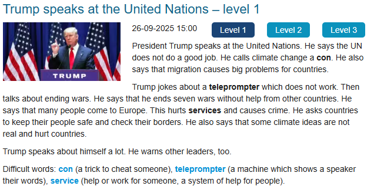

### Entendimento
O presidente Trump falou nas Nações Unidas. Ele disse que a ONU não fez um bom trabalho. Ele chamou as mudanças climáticas de con (um truque para enganar alguém). Ele também disse que a migração causa grandes problemas aos países.

Trump brinca sobre o teleprompter que não está funcionando. Depois falou sobre o término da guerra. Ele disse que terminou com 7 guerras sem a ajuda de outros países. Ele disse que muitas pessoas vêm para a Europa. Isso atrapalha os serviços e causa crimes. Ele pediu aos países que mantenham suas populações seguras e verifiquem suas fronteiras. Ele também disse que algumas ideias climáticas não são reais e prejudicam os países.

Trump fala muito sobre si mesmo. Ele também adverte outros líderes.

### Novas palavras

UN = ONU

con = Um truque para enganar alguém

which = que

Then = então, depois, em seguida

keep = manter

asks = 	pedir, perguntar, convidar

borders = fornteiras

warns = advertir, avisar, prevenir

